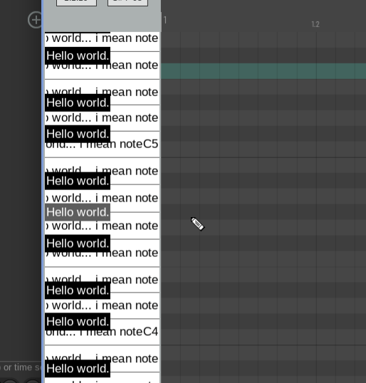

This is a modified version of the [sine example](../sine) that implements the [note-name extension](https://github.com/free-audio/clap/blob/main/include/clap/ext/note-name.h), which is unsupported in zigplug.

